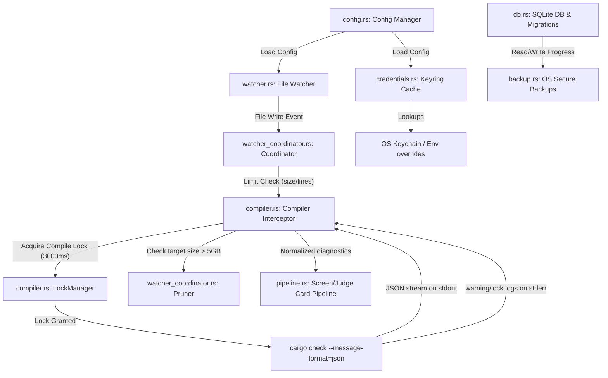

# Architecture Design & Component Map

This document outlines the high-level architecture of **Murshid**'s watcher/compiler substrate. The task ladder in `specs/INDEX.md` is the authoritative scope record; the card pipeline built on top of this substrate (screen/judge stages, noise machinery, memory) is summarized in §3.

---

## 1. System Topology

Murshid uses a multi-layered local-first architecture to monitor filesystem events, run asynchronous background cargo compilations, and track user mastery metrics locally.

---

## 2. Key Modules & Implementations

### (a) Configuration Manager (`src/config.rs`)
*   **Purpose:** Expose user and project settings, merging defaults with system-level, user-level, and project-level TOML configurations.
*   **Lock Policy:** If a system-wide configuration sets `lock_policy = true` for a section, any attempts by users or projects to override settings in that section are ignored, resetting them to system defaults.
*   **Security:** System-level configuration files must be owned by Root/Administrator and set with tight POSIX permissions (`0644` or `0600`).

### (b) Local Database & Migrations (`src/db.rs`, `src/backup.rs`)
*   **Database Settings:** Uses SQLite under WAL (Write-Ahead Logging) mode and `synchronous = NORMAL` for highly concurrent, safe local operations.
*   **Migrations Engine:** Manages schema changes incrementally using `PRAGMA user_version` wrapped in immediate transactions. If a migration fails, the database automatically rolls back using a duplicate copy saved as a `db.migration_backup`.
*   **Corruption Recovery:** Upon catching header mismatches or PRAGMA integrity check failures, it archives the corrupted database as `profile.db.corrupt.<timestamp>`, initializes a clean database, and restores the user's progress mastery thresholds from the OS platform native backup store (`NSUserDefaults` on macOS, Registry on Windows, and `.state_backup` on Linux).

### (c) Credentials Cache (`src/credentials.rs`)
*   **Key Storage:** Integrates with OS credential managers (macOS Keychain, Linux Secret Service, Windows Credential Manager) via the `keyring` crate.
*   **Volatile In-Memory Cache:** Caches credentials in a thread-safe, global static `Arc<RwLock<Option<CachedKeys>>>` resolving in `<1ms` to avoid blocking watcher loops.
*   **Hot-Reloading (currently unwired):** A config-poll thread and SIGHUP reload path exist in `credentials.rs` but `credentials::init()` is never called from `main` — keys are resolved once at `watch` startup, so rotation requires a restart. Slated for wire-or-delete in the T9 cleanup.

### (d) Filesystem Watcher (`src/watcher.rs`, `src/watcher_coordinator.rs`)
*   **Watcher Engine:** Monitors filesystem events using `notify::RecommendedWatcher`.
*   **Throttling Coordinator:** Restricts thread usage and file descriptor counts process-wide. If FD count exceeds the configuration limit, it falls back to a background polling thread (running every 2500ms).
*   **Exclusion Boundaries:** Filters out events for directories matching `target/`, `.git/`, and `.murshid_experiments/`, and ignores files exceeding 50KB or 1500 lines.

### (e) Asynchronous Compiler Interceptor (`src/compiler.rs`, mounted as the Rust pack's adapter)
*   **Compile Execution:** Spawns background `cargo check --message-format=json` runs, setting `CARGO_TARGET_DIR` to `<project-root>/target/murshid/` to isolate compiler runs from the developer's normal cargo builds.
*   **Cancellation Safety:** When a new file write trigger is received, the interceptor immediately sends a `SIGTERM` to the active compiler process, followed by `SIGKILL` after 500ms if it hasn't terminated, preventing compiler thread accumulation.
*   **Error Parsing & Prioritization:** Parses the stdout JSON stream, filtering warnings and prioritizing errors matching the active file, truncating the result list to at most 3 diagnostics.
*   **Infrastructure Error Isolation:** Evaluates the exit code and stderr content for environment issues (network offline, package version conflicts, lock timeouts). If detected, it bypasses Socratic prompts and mastery updates.

---

## 3. Card Pipeline & Language-Pack Seam (T1–T7)

Above the substrate, the shipped pipeline is: normalized diagnostics + session
diff → **stage-1 screen model** (cheap/fast; emits candidate teaching moments
and positive-application detections) → noise gate (budget knob, dedup, snooze,
throttle, queue — `noise.rs`, `budget.rs`, `suppression.rs`, `throttle.rs`,
`queue.rs`) → **stage-2 judge model** (strict output contract, `judge.rs`) →
one on-screen card (`card.rs`) with ladder rungs, threads, and BKT-backed
memory (`ladder.rs`, `thread.rs`, `bkt.rs`, `memory.rs`).

Language support is data-driven: `packs/<lang>/` carries the diagnostics
adapter config, taxonomy, canon, prompts, and grammar reference; `pack.rs` is
the only code-registration surface (adapters mount as its child modules —
`compiler.rs` for Rust, `go_adapter.rs` for Go). Model slots (`[models.screen]`
/ `[models.judge]`) dispatch via `provider.rs` to Gemini, Claude, or any
OpenAI-compatible local server (Ollama, LM Studio) per T8.
