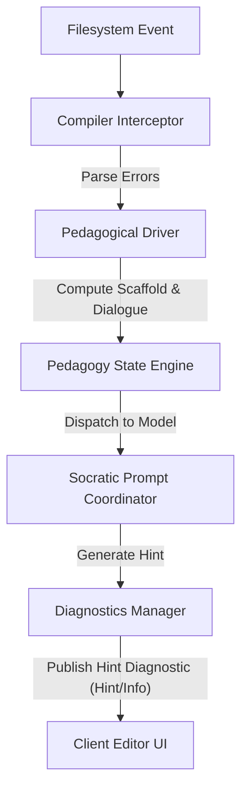

# Design Plan: LSP Goal & Task Feedback Architecture

This design plan describes how the Murshid LSP server will render inline annotations and custom code actions to guide developers through compiler-related learning goals and tasks.

---

## 1. Architectural Foundations & Current State Analysis

### 1.1 Communication Infrastructure
*   **Stdio Proxy (`lsp-proxy`):** The editor client launches `murshid lsp-proxy` as its LSP execution target. The proxy connects via Unix Domain Sockets (macOS/Linux) at `~/Library/Application Support/murshid/lsp.sock` or Windows Named Pipes at `\\.\pipe\murshid-lsp`.
*   **Workspace Multiplexing (`lsp/server.rs`):** The long-running daemon accepts socket/pipe connections. Upon connection, the proxy sends a single-line handshake JSON:
    ```json
    {"workspace_root": "/absolute/path/to/project", "client_pid": 12345}
    ```
    The daemon spawns a connection handler thread, resolves or creates a unique `WorkspaceContext`, and multiplexes active queues, compilation watch loops, and diagnostic states independently.
*   **Compiler Interceptor (`compiler.rs`):** As files are saved, the file watcher compiles the project inside `<project-root>/target/murshid/` (isolated target folder) using `cargo check --message-format=json`. The interceptor parses the JSON stream for primary compiler error codes (e.g. `E0382`), error messages, target file locations, and spans.

### 1.2 Current LSP Structs
The current code base defines LSP structures in:
*   [src/lsp/diagnostics.rs](file:///Users/yasir/src/yahmad/murshid/src/lsp/diagnostics.rs):
    *   `Position`, `Range`, and `Diagnostic` (includes fields for severity, code, source, message, and tags).
    *   `DiagnosticsManager`: Manages file-level diagnostic buffers and processes `didChange` events using `handle_did_change` to immediately clear diagnostics on edited lines.
    *   `format_publish_diagnostics`: Formats the `textDocument/publishDiagnostics` notification payload.
*   [src/lsp/code_actions.rs](file:///Users/yasir/src/yahmad/murshid/src/lsp/code_actions.rs):
    *   `Command` and `CodeAction` (includes fields for title, kind, diagnostics, command, and is_preferred).
    *   `create_murshid_code_action`: Instantiates a CodeAction with `murshid.openChatPanel` command triggers.
    *   `format_socratic_guidance_fallback`: Prepares formatted Markdown fallback text for client environments missing side panel panel integrations.

---

## 2. Inline Annotations Design (LSP Diagnostics)

Inline annotations are published to the client editor as LSP diagnostics under a dedicated diagnostic source ID (`source = "murshid"`). This decouples Murshid's pedagogical hints from the compiler’s own direct diagnostics.



### 2.1 Diagnostic Severity & Tagging
*   **Decoupled Severities:** Socratic annotations MUST be published using `DiagnosticSeverity.Hint` (value `4`) or `DiagnosticSeverity.Information` (value `3`) to avoid standard editor error lists clutter.
*   **Fade-Out Overlays:** Socratic hint diagnostics are tagged with `DiagnosticTag.Unnecessary` (value `1`) to prompt the editor to fade the annotated code block, signaling that the code contains a borrow-checker or syntax conflict.

### 2.2 Immediate Diagnostic Clearing (Latency < 50ms)
To keep the editor highly responsive, Socratic diagnostics are not bound to full asynchronous compilation check cycles.
1.  **didChange Interception:** The LSP server listens to `textDocument/didChange` JSON-RPC notifications.
2.  **Overlap Calculation:** When changes are notified, the line ranges of the edit are compared against active diagnostic line spans.
3.  **Local State Purge:** If the edit line overlaps with any active diagnostic, that diagnostic is immediately removed from the workspace diagnostics collection.
4.  **Instant Publish:** The updated list of diagnostics is immediately published back to the client editor in under 50ms, giving the developer instant visual feedback that their edit has cleared the Socratic prompt.

### 2.3 Format & Markdown payloads
Diagnostic messages are sent as Markdown payloads to allow the client editor extension to format diagnostic details (links, bold terms, headers) cleanly.

---

## 3. Socratic Code Actions Design

Custom code actions act as triggers that allow developers to act on Socratic hints and engage in dialogue.

### 3.1 Code Action Registration
The server registers code actions with specific Socratic categories under custom action kinds:
*   `quickfix.murshid`: For resolving standard syntax or lifetime compiler issues.
*   `refactor.murshid`: For restructuring code blocks under borrow-checker constraints.

### 3.2 Command Dispatching (`workspace/executeCommand`)
Selecting a Socratic code action does not apply automatic code modifications. Instead, it dispatches an editor workspace command:
*   **Command:** `murshid.openChatPanel`
*   **Arguments:** `[ "<document_uri>", <line_number> ]`
The editor extension intercepts this command and initiates a Socratic side panel / dialogue window connected via socket to the workspace context dialogue history.

### 3.3 Hover Fallback Formatting
For editor environments that do not support side panels, interactive enclaves, or custom command triggers:
*   The Socratic coordinator appends the complete Socratic guidance message directly inline to the diagnostic hover payload.
*   The hint text is appended using a divider:
    ```markdown
    <Original compiler error message>

    ---

    ### 🧭 Socratic Guidance
    <Socratic Analogy and Progressive Questions>
    ```

---

## 4. Special Diagnostics & Warnings Policy

To provide administrative and infrastructure feedback without polluting build streams, the LSP server publishes warnings and information messages on Line 1 of the active buffer:

| Event / Issue | Target Range | Severity | Message String |
| :--- | :--- | :--- | :--- |
| **API Auth/Rate Error** | Line 1 (`0:0` to `0:100`) | `Warning` | `"Socratic check suspended: invalid API key or connection unauthorized. Verify your credential configuration."` |
| **File Limit Exceeded** | Line 1 (`0:0` to `0:100`) | `Information` | `"Socratic assistance suspended: file exceeds maximum line/size thresholds."` |
| **Polling Fallback** | Project-wide / Tray | `Information` | `"Watcher resources exhausted. Downgrading workspace to background polling loop."` |
| **Toolchain/Infra Error** | Project-wide / Tray | `Information` | `"Compilation check suspended due to local toolchain environment errors."` |

---

## 5. Message Payloads & JSON-RPC Protocol Examples

### 5.1 Client Handshake (Initial Connection)
Before standard LSP JSON-RPC messages begin, the client proxy sends the multiplexing context header line:
```json
{
  "workspace_root": "/Users/yasir/src/yahmad/murshid",
  "client_pid": 48202
}
```

### 5.2 `textDocument/publishDiagnostics` Notification
Sent by the server to publish Socratic diagnostics:
```json
{
  "jsonrpc": "2.0",
  "method": "textDocument/publishDiagnostics",
  "params": {
    "uri": "file:///Users/yasir/src/yahmad/murshid/src/main.rs",
    "diagnostics": [
      {
        "range": {
          "start": { "line": 42, "character": 8 },
          "end": { "line": 42, "character": 24 }
        },
        "severity": 4,
        "code": "E0382",
        "source": "murshid",
        "message": "Use of moved value: `x`.\n\n### 🧭 Socratic Guidance\nConsider who owns the book when you lend it to a friend. Can you still read it?",
        "tags": [1]
      }
    ]
  }
}
```

### 5.3 `textDocument/codeAction` Response
The response from the server containing the custom Socratic code action:
```json
{
  "jsonrpc": "2.0",
  "id": 4,
  "result": [
    {
      "title": "Ask Murshid: Use of moved value: `x`",
      "kind": "quickfix.murshid",
      "diagnostics": [
        {
          "range": {
            "start": { "line": 42, "character": 8 },
            "end": { "line": 42, "character": 24 }
          },
          "severity": 4,
          "code": "E0382",
          "source": "murshid",
          "message": "Use of moved value: `x`."
        }
      ],
      "command": {
        "title": "Open Socratic Chat Panel",
        "command": "murshid.openChatPanel",
        "arguments": [
          "file:///Users/yasir/src/yahmad/murshid/src/main.rs",
          42
        ]
      },
      "isPreferred": true
    }
  ]
}
```

---

## 6. Implementation Phasing Strategy

We will implement this feedback plan incrementally inside the `src/lsp/` module files:

### Phase 1: Core Parsing & JSON-RPC Loop in `server.rs`
1.  Extend the UDS interaction loop in [src/lsp/server.rs](file:///Users/yasir/src/yahmad/murshid/src/lsp/server.rs) to recognize standard JSON-RPC payloads (detecting content-length and parsing JSON payloads).
2.  Dispatch incoming `textDocument/didChange`, `textDocument/codeAction`, and standard lifecycle initialization hooks dynamically to the diagnostic and code-action managers.

### Phase 2: Diagnostic Updates & Change Tracking in `diagnostics.rs`
1.  Integrate the `DiagnosticsManager` inside the compilation callback pipeline. When `cargo check` outputs compiler errors, trigger a pedagogical model query and push the resulting Socratic hint to `DiagnosticsManager`.
2.  Publish diagnostics using `format_publish_diagnostics` over the active workspace socket connection.
3.  Bind standard `didChange` events to the active overlap clearing loop, ensuring diagnostics are immediately cleared from line-edits.

### Phase 3: Code Actions Binding in `code_actions.rs`
1.  Define the command serialization schema to execute `murshid.openChatPanel` on the client.
2.  Handle `textDocument/codeAction` requests by looking up the current file's Socratic diagnostic alerts and mapping them using `create_murshid_code_action`.

### Phase 4: Verification and Unit Tests
1.  Write integration tests inside `src/lsp/diagnostics.rs` and `src/lsp/code_actions.rs` verifying:
    *   LSP-compliant serialization of custom code actions.
    *   Fading tags (`DiagnosticTag.Unnecessary`) and severity level filters.
    *   Low-latency `<50ms` diagnostics deletion on edit events.
    *   Special warnings triggers (such as rate limits on line 1).
